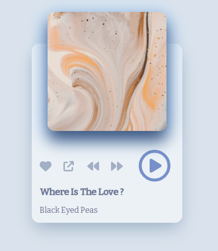

# Création d'un mini audio player

J'ai voulu recréer un système d'écoute de musique, un peu comme un Ipod :grin: :musical_note:. J'ai télécharger quelques musiques sur Youtube afin de créer cette application. J'aimerais par la suite l'amérliorer en ajoutant une barre de progression dynamique selon l'avancée de la musique. Pour l'instant nous avons un bouton "like", un autre qui redirige vers la vidéo Youtube de la musique et bien évidemment les commandes qui nous permettent de changer de musique ou de mettre pause ou play.

  

## Technologies:

- HTML
- CSS
- REACTJS

## Tester l'application

Cloner ce [repository](https://github.com/Cynthiacrn/react_music_player.git)

L'ouvrir dans votre éditeur préféré

Ouvrir le terminal et faire `npm start`

Bonne découverte !
